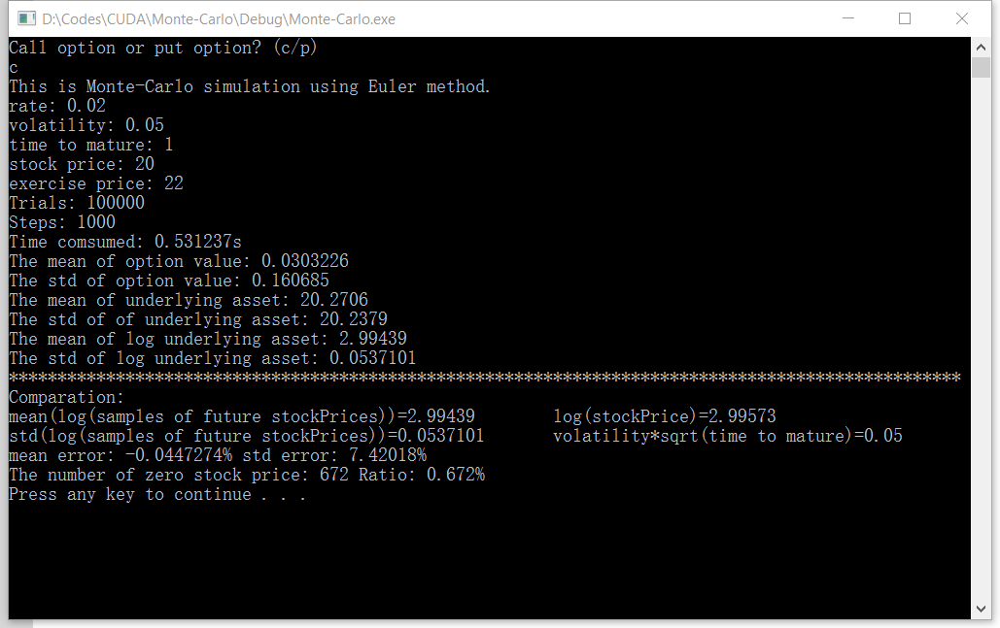
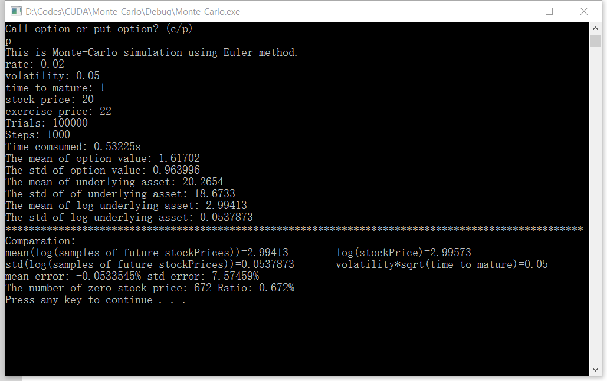
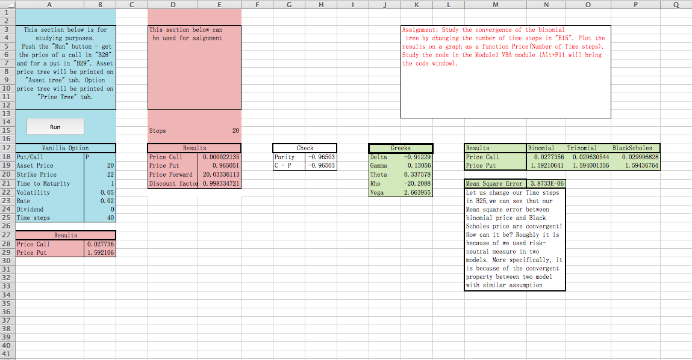

#Home Work 4

Author: Yuxuan Xia

Tool: CUDA 8.0

##Condition

rate = 0.02

volatility = 0.05

stockPrice = 20

strickPrice = 20

timeToMature = 1 (year)

n_iters = 1000 (number of steps)

n_trials = 100000 (number of trials)

##Result
###Call option

###Put option

###Black Scholes and Binomial tree

##Analysis
###Environment

Language: CUDA 8.0 in C++

IDE: Visual Studio 2015

Operation System: Windows 10

###Efficiency

Simulations: 1e5 trials * 1e3 steps

Time comsumed: ~0.5s

**One can see the super power of GPU multi-threads programming!**

###Stock price simulation
1. Geometic Brownian Motion Property: log-normal

	Using Euler discretization in order to simulate geometric brownian motion.

	In result, one can see that the mean of log(samples of future stock price) is approximate equial to log(stock price today) which means log(stock price) it is a martingale. 

	Moreover the std of log(samples of future stock price) is approximate equal to volatility × sqrt(time to mature).

	In conclusion, the future stock price simulated by Euler discretization method agree with geometric brownian motion whose distribution of a fixed t is log-normaled.
	
2. Trueness Error & Stopped Process
	
	However, when I start to calculate the statics property of log(samples of future stock prices) I find that there are some samples whose value equal to zero, which is undefined in log function. Fortunately, the ratio of these bad values is about only 0.67%. So I ignore these points to obtain the previous results.
	
	To be precise, the bad value result from the computer's trueness error. As the exponential of any finite number is bigger than 0, one can never obtain 0 stock price in Euler method theoretically. However, if the stock price at any time equal to 0, it will always be 0 as stockPrice *= exp(Euler method here).
	
	In conclusion, the stock price is not a pure geometric Brownian motion. It is a stopped process. And trueness error combined with stopping time account for the error between Black Scholes and Euler Discretization method.
	
###option value simulation

European option value = max(0,future stockprice - strike price)

All statical property or errors can be gathered by future stock price. It's neither log normal nor normal. Then, not repeat here.

